# Quick Asset Actions - Unreal Engine 5 Plugin

The Quick Asset Actions plugin streamlines the process of finding and performing different actions on assets in the content browser. The plugin displays a list of assets under a user-selected folder and provides several options for the user to filter the displayed assets on search critera such as unused assets, assets with duplicate names, and more. The plugin also provides users the ability to perform common actions on one or more assets selected from the list such as delete, duplicate, rename, etc. In addition to the common actions included in Unreal Engine, the plugin features extended actions that allow users to replace an unwanted string in a list of asset names and automatically add prefixes according to standard naming conventions.

This plugin was originally made for use by Deadlift Studios engineers and artists.

## Table of Contents
- [Overview](#overview)
  * [Features](#features)
  * [Installing the plugin](#installing-the-plugin)
  * [Opening the plugin](#opening-the-plugin)
  * [Plugin Defaults](#plugin-defaults)
- [Navigating Content Browser to Asset](#navigating-content-browser-to-asset)
- [Sorting the List View](#sorting-the-list-view)
- [Filtering the List View](#filtering-the-list-view)
  * [List All Assets](#list-all-assets)
  * [List Unused Assets](#list-unused-assets)
  * [List Duplicate Name Assets](#list-duplicate-name-assets)
  * [List Assets with No Prefix (or Incorrect Prefix)](#list-assets-with-no-prefix-or-incorrect-prefix)
- [Selecting Assets in the List View](#selecting-assets-in-the-list-view)
  * [Select / Deselect](#select--deselect)
  * [Select All](#select-all)
  * [Deselect All](#deselect-all)
- [Asset Actions](#asset-actions)
  * [Rename (Single Asset Action only)](#rename-single-asset-action-only)
  * [Add Prefixes for Selected](#add-prefixes-for-selected)
  * [Delete Selected](#delete-selected)
  * [Duplicate Selected](#duplicate-selected)
  * [Replace String for Selected](#replace-string-for-selected)

## Overview

Quick Asset Actions Demo


Overview of the UI


### Features

1. List all assets under a selected folder with the following details:
   * Asset Type (Asset Class)
   * Asset Name
   * Asset Parent Folder (Path)
   * \# of Refs (Number of asset referencers)
2. Displays number of assets in the current list view (asset count)
3. Displays selected folder path
4. Doubleclick row to navigate to asset in content browser
5. Filter list of assets by: 
   * Unused Assets
   * Duplicated Name Assets (Assets with exactly the same name)
   * Assets with No Prefix (or incorrect prefixes)
6. Allows user to select assets by checking or unchecking checkboxes
   * Select all
   * Deselect all
7. Rename a single asset
8. Add Prefixes for selected assets
9. Delete selected assets
10. Duplicate selected assets
11. Replace a string or phrase for selected assets

### Installing the plugin

NOTE: This plugin is a editor only plugin and is intended to be used with the Unreal Editor. It was built in Unreal Engine 5.3.2 and is compatible with Unreal Engine 5.3.

in the plugins folder in the repo, there are the following files and folders:
1. Config/
2. Resources/
3. Source/
4. AssetActionsManager.uplugin

In your Unreal Engine Project directory, add a folder `Plugins` if there is not already one there. In the Plugins folder, add another folder for the Quick Asset Actions Plugin (mine is named AssetActionsManager but it can be whatever you choose). Clone or save the repo in the folder for the Quick Asset Actions Plugin. It should look something like this:

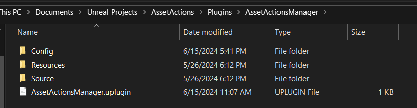

Next, open your games's `.sln` file and rebuild the game. This will generate the necessary Binaries, Config, and Content folders.

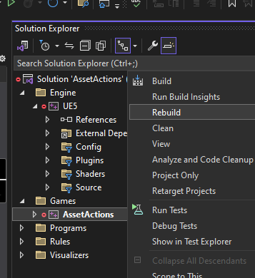

You should be able to open your game in Unreal Editor now. You can do this by opening your `.uproject` file. Check that the plugin is activated by going to the Edit menu -> Plugins. Under PROJECT, there should be a new category called “Asset Actions”. Select it and make sure that Quick Asset Actions is checked.

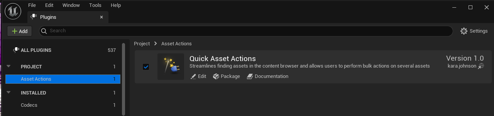

### Opening the plugin

The plugin adds a new menu entry to the right-click menu in the content browser. Simply right-click on a folder and click on Quick Asset Actions. This will open the plugin tab that lists all assets under the selected folder. 

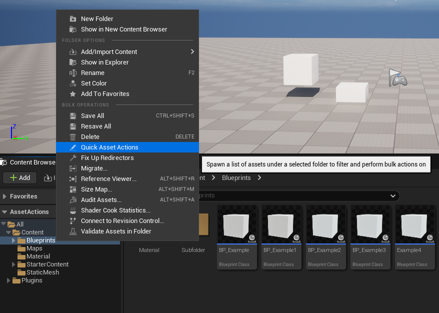

You can click on this menu option when the tab is currently open and it will refresh the whole tab. If you click on a different folder, the tab will refresh with the new selected folder. Basically, you don’t have to close the tab to select a different folder. However, you can only have one tab open at a time. While technically you are able to run the plugin on the main “Content” folder which will include everything, this makes the plugin very slow. **It is recommended to use the plugin on smaller folders.** 

The plugin will search through all subfolders within a folder and display all assets found so it is not needed to open the plugin on every subfolder if you want those assets.

### Plugin Defaults
The plugin will open by default on:
* List All Assets
* Sort by Asset Name A → Z

These default settings will apply any time the Quick Asset Actions menu button is clicked. Clicking the manual refresh button on the right side of the window will **not** apply these default settings.

## Navigating Content Browser to Asset

Double click the row for an asset to navigate to the asset in the content browser:

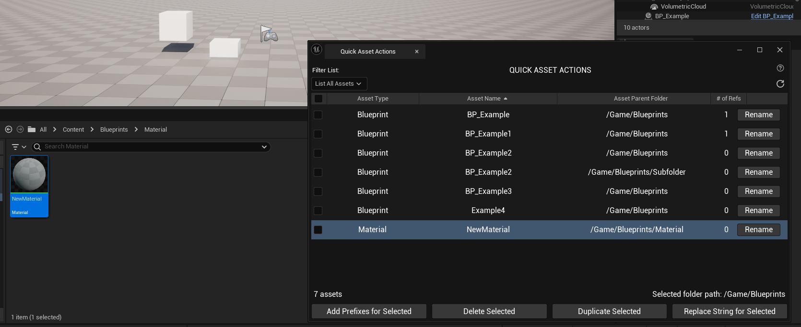

## Sorting the List View

You are able to sort by:
1. Ascending - A → Z for alphanumeric, least → most for only numeric
2. Descending - Z → A for alphanumeric, most → least for only numeric

For the following columns:
1. CheckBox
   * Ascending - Checked assets first which are subsorted by Asset Name A → Z, then Unchecked assets which are also subsorted by Asset Name A → Z
   * Descending - Unchecked assets first which are subsorted by Asset Name A → Z, then Checked assets which are also subsorted by Asset Name A → Z
2. Asset Type
3. Asset Name
4. Asset Parent Folder
5. \# of Refs

## Filtering the List View

### List All Assets

This is the default option and will display all assets found by the tool in the selected folder and its subfolders.

### List Unused Assets

Unreal keeps track of asset references which you can see when you try to delete an asset that has a reference.

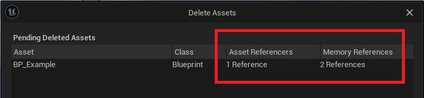

The tool checks the number of the references for each asset in the selected folder and only displays the assets that have 0 references. NOTE: The tool is checking asset referencers only.

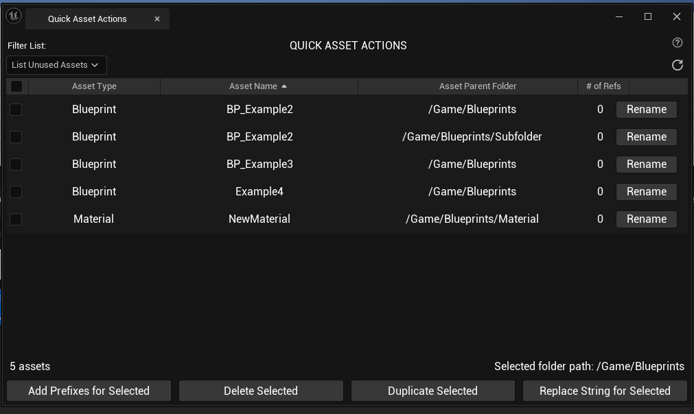

### List Duplicate Name Assets

Unreal will prevent assets from having the exact same name in the same folder but does not prevent exact same names if the assets are in different folders. This can become a problem when migrating projects or as projects get larger and assets get lost in the mix.

The tool will check for assets with exact same names and display only those assets so that you can easily identify and rename or delete to fix any issues.

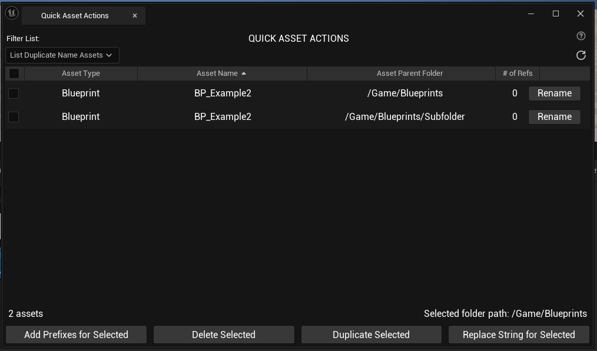

### List Assets with No Prefix (or Incorrect Prefix)

Unreal has a convention for recommended prefixes for assets based on asset class. This makes it easier to find assets and standardizes naming across the project. 

Based on the asset classes currently in our project, these are the asset prefixes I set for the tool:

<details>
 <summary>List of Prefixes</summary>

 ```
{ TEXT("AimOffsetBlendSpace"), TEXT("AO_")},
{ TEXT("AnimBlueprint"), TEXT("ABP_") },
{ TEXT("AnimMontage"), TEXT("AM_") },
{ TEXT("AnimSequence"), TEXT("AS_") },
{ TEXT("BehaviorTree"), TEXT("BT_")},
{ TEXT("BlackboardData"), TEXT("BB_") },
{ TEXT("BlendSpace"), TEXT("BS_") },
{ TEXT("BlendSpace1D"), TEXT("BS_") },
{ TEXT("Blueprint"), TEXT("BP_")},
{ TEXT("ControlRigBlueprint"),TEXT("CRBP_") },
{ TEXT("CurveFloat"), TEXT("Curve_") },
{ TEXT("CurveLinearColor"), TEXT("Curve_") },
{ TEXT("CurveLinearColorAtlas"), TEXT("Curve_") },
{ TEXT("CurveVector"), TEXT("Curve_") },
{ TEXT("DataTable"),TEXT("DT_") },
{ TEXT("FoliageType_InstancedStaticMesh"), TEXT("FT_") },
{ TEXT("Font"), TEXT("Font_")},
{ TEXT("FontFace"), TEXT("Font_")},
{ TEXT("IKRetargeter"), TEXT("IK_") },
{ TEXT("IKRigDefinition"), TEXT("IK_") },
{ TEXT("LandscapeGrassType"), TEXT("LG_") },
{ TEXT("LandscapeLayerInfoObject"), TEXT("LL_") },
{ TEXT("LevelSequence"), TEXT("LS_") },
{ TEXT("MapBuildDataRegistry"), TEXT("MapBD_") },
{ TEXT("Material"), TEXT("M_") },
{ TEXT("MaterialFunction"), TEXT("MF_") },
{ TEXT("MaterialInstanceConstant"), TEXT("MI_") },
{ TEXT("MaterialParameterCollection"), TEXT("MPC_") },
{ TEXT("ParticleSystem"), TEXT("PS_") },
{ TEXT("PhysicalMaterial"), TEXT("PM_") },
{ TEXT("PhysicsAsset"), TEXT("PHYS_") },
{ TEXT("PoseAsset"), TEXT("POSE_") },
{ TEXT("ProceduralFoliageSpawner"), TEXT("FS_") },
{ TEXT("SkeletalMesh"), TEXT("SM_") },
{ TEXT("SkeletalMeshLODSettings"), TEXT("SK_") },
{ TEXT("SkeletalMeshLODSettings"), TEXT("SK_") },
{ TEXT("Skeleton"), TEXT("SKEL_") },
{ TEXT("SoundClass"), TEXT("SC_") },
{ TEXT("SoundCue"), TEXT("SFX_") },
{ TEXT("SoundMix"), TEXT("SMix_") },
{ TEXT("SoundWave"), TEXT("SFX_") },
{ TEXT("StaticMesh"), TEXT("SM_") },
{ TEXT("SubsurfaceProfile"), TEXT("SSP_") },
{ TEXT("Texture"), TEXT("T_")},
{ TEXT("Texture2D"), TEXT("T_")},
{ TEXT("TextureCube"), TEXT("TC_") },
{ TEXT("TextureRenderTarget"), TEXT("RT_") },
{ TEXT("TextureRenderTarget2D"), TEXT("RT_") },
{ TEXT("UserDefinedEnum"), TEXT("E_") },
{ TEXT("UserDefinedStruct"), TEXT("S_") },
{ TEXT("VectorFieldStatic"), TEXT("VF_") },
{ TEXT("WidgetBlueprint"), TEXT("WBP_") },
```
</details>

The tool will display assets whose names does not start with the prefix for its class. This will include assets that have the “wrong” prefix based on the conventions stated above.

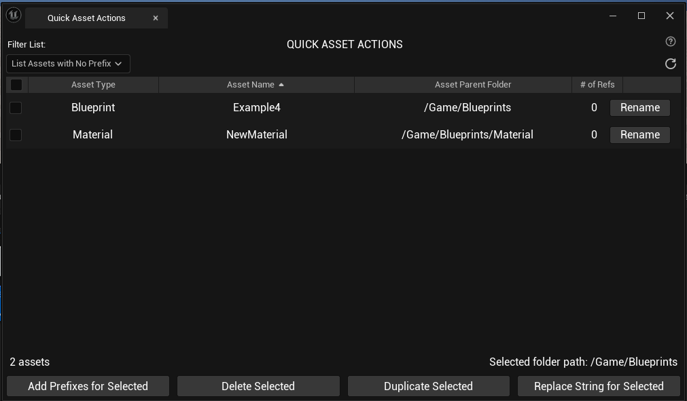

## Selecting Assets in the List View
### Select / Deselect

Click the checkbox in the row for the asset that you would like to select or deselect. Clicking an unchecked checkbox will make it checked (select) and clicking a checked checkbox will make it unchecked (deselect). Checked checkboxes are considered **Selected Assets** for bulk actions. NOTE: the header checkbox will change to a - to signify that there are checked and unchecked assets in the list. 

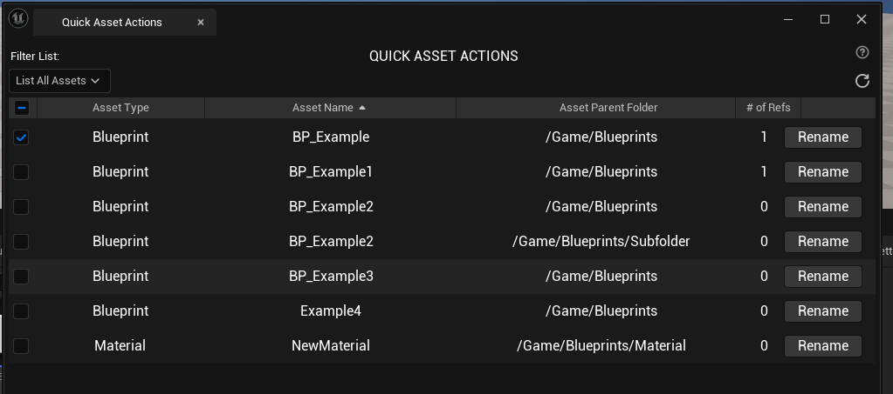

### Select All

Click the unchecked header checkbox to select all assets displayed in the assets list view:

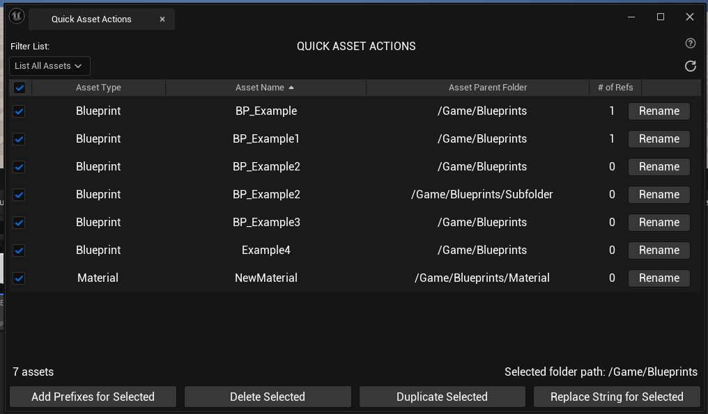

This header row checkbox will also switch to a checked state if you individually select all assets in the list.

### Deselect All

If the header checkbox is in a checked state or an undetermined state ( - ), click the header row checkbox to deselect all assets displayed in the asset list view. This header row checkbox will also switch to a unchecked state if you individually deselect all assets in the list.

## Asset Actions
### Rename (Single Asset Action only)

Rename a single asset by selecting the Rename button in the same row of the asset you want to rename. For example, if I wanted to rename the BP_Example asset, I would click the button for that row. This will open a popup that displays the current asset name and an entry box to enter the new name:

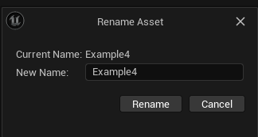

NOTE: If you try to enter the same name or no name, the tool will alert you and will not attempt to rename the asset.

After entering a new name, click rename. The asset list view will automatically refresh the view and the new name will be displayed.

### Add Prefixes for Selected

It is recommended you only do this to assets that have no prefix (not incorrect prefixes) This limitation is because the possibilities of incorrect name formats is very wide and removing or changing strings based on _ in the name poses risks of bulk changing names in ways we do not expect. It is better for us to intentionally fix incorrect names with the Rename button.

Here is the list of prefix conventions based on the asset classes in our project:
<details>
 <summary>List of Prefixes</summary>

 ```
{ TEXT("AimOffsetBlendSpace"), TEXT("AO_")},
{ TEXT("AnimBlueprint"), TEXT("ABP_") },
{ TEXT("AnimMontage"), TEXT("AM_") },
{ TEXT("AnimSequence"), TEXT("AS_") },
{ TEXT("BehaviorTree"), TEXT("BT_")},
{ TEXT("BlackboardData"), TEXT("BB_") },
{ TEXT("BlendSpace"), TEXT("BS_") },
{ TEXT("BlendSpace1D"), TEXT("BS_") },
{ TEXT("Blueprint"), TEXT("BP_")},
{ TEXT("ControlRigBlueprint"),TEXT("CRBP_") },
{ TEXT("CurveFloat"), TEXT("Curve_") },
{ TEXT("CurveLinearColor"), TEXT("Curve_") },
{ TEXT("CurveLinearColorAtlas"), TEXT("Curve_") },
{ TEXT("CurveVector"), TEXT("Curve_") },
{ TEXT("DataTable"),TEXT("DT_") },
{ TEXT("FoliageType_InstancedStaticMesh"), TEXT("FT_") },
{ TEXT("Font"), TEXT("Font_")},
{ TEXT("FontFace"), TEXT("Font_")},
{ TEXT("IKRetargeter"), TEXT("IK_") },
{ TEXT("IKRigDefinition"), TEXT("IK_") },
{ TEXT("LandscapeGrassType"), TEXT("LG_") },
{ TEXT("LandscapeLayerInfoObject"), TEXT("LL_") },
{ TEXT("LevelSequence"), TEXT("LS_") },
{ TEXT("MapBuildDataRegistry"), TEXT("MapBD_") },
{ TEXT("Material"), TEXT("M_") },
{ TEXT("MaterialFunction"), TEXT("MF_") },
{ TEXT("MaterialInstanceConstant"), TEXT("MI_") },
{ TEXT("MaterialParameterCollection"), TEXT("MPC_") },
{ TEXT("ParticleSystem"), TEXT("PS_") },
{ TEXT("PhysicalMaterial"), TEXT("PM_") },
{ TEXT("PhysicsAsset"), TEXT("PHYS_") },
{ TEXT("PoseAsset"), TEXT("POSE_") },
{ TEXT("ProceduralFoliageSpawner"), TEXT("FS_") },
{ TEXT("SkeletalMesh"), TEXT("SM_") },
{ TEXT("SkeletalMeshLODSettings"), TEXT("SK_") },
{ TEXT("SkeletalMeshLODSettings"), TEXT("SK_") },
{ TEXT("Skeleton"), TEXT("SKEL_") },
{ TEXT("SoundClass"), TEXT("SC_") },
{ TEXT("SoundCue"), TEXT("SFX_") },
{ TEXT("SoundMix"), TEXT("SMix_") },
{ TEXT("SoundWave"), TEXT("SFX_") },
{ TEXT("StaticMesh"), TEXT("SM_") },
{ TEXT("SubsurfaceProfile"), TEXT("SSP_") },
{ TEXT("Texture"), TEXT("T_")},
{ TEXT("Texture2D"), TEXT("T_")},
{ TEXT("TextureCube"), TEXT("TC_") },
{ TEXT("TextureRenderTarget"), TEXT("RT_") },
{ TEXT("TextureRenderTarget2D"), TEXT("RT_") },
{ TEXT("UserDefinedEnum"), TEXT("E_") },
{ TEXT("UserDefinedStruct"), TEXT("S_") },
{ TEXT("VectorFieldStatic"), TEXT("VF_") },
{ TEXT("WidgetBlueprint"), TEXT("WBP_") },
```
</details>

NOTE: An underscore after the prefix letters will automatically be added.

The tool will add the prefix based on the asset class for each selected asset and the asset list view will refresh with the newly named assets displayed.

In the case of Material Instance, the tool will look for the string `_Inst` as Unreal will add that suffix automatically when create a Material Instance. Since we already account for this with the prefix `MI_`, the asset name does not need this string. The tool will remove that string from the asset name while adding the prefix.

### Delete Selected

The tool will attempt to delete all selected assets. If an asset has a reference (either asset or memory), the Unreal Delete Asset window will popup:

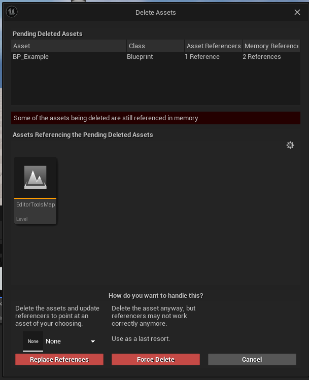

NOTE: Check these references before clicking Force Delete. If assets only have memory references, this popup will still appear. It is safe to force delete only memory references.

After deletion, the tool will refresh the asset list view and remove the deleted assets from the list.

### Duplicate Selected

The tool will attempt to duplicate the selected assets by a user entered number of times. When the Duplicate Selected button is pressed, a popup will appear asking for the number of times you want to duplicate the asset. 

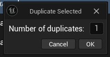

The minimum is 1, the maximum is 25. This does not prevent you from duplicated more than 25 times but sets a limit for duplication at the same time to minimize the chance of the editor crashing due to overloading the program. 

The tool follows Unreal’s convention of adding an integer after the asset name. This will lead to weird results if you have another naming convention (_001, _1, .1, etc) or if you try to duplicate an already duplicated asset. Because of this, it is recommended to only duplicate the original asset. 

However, the tool will be able to check if the version its trying to duplicate to already exists. EX) BP_Example, BP_Example1, and BP_Example2 already exist in the folder. When BP_Example is duplicated, it will add BP_Example3.

After the assets have been duplicated, the asset list view will refresh with the new asset(s) displayed.

### Replace String for Selected

The tool will attempt to replace a user entered string or phrase with a user entered new string or phrase for the asset names for the selected assets. When the Replace String for Selected button is pressed, a popup will appear asking the user to enter the “String to Replace” and the “New String”:

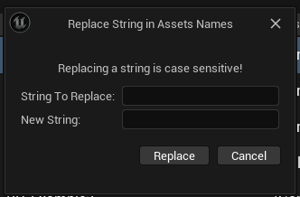

NOTE: Neither of these fields can be left blank and strings are case sensitive!

The tool will determine if the “String to Replace” is in the Asset Names of the selected assets. If the “String to Replace” is found, it will replace it with the “New String”.

After all selected assets have been checked and renamed if needed, the tool will refresh the asset list view and display the new asset names.
